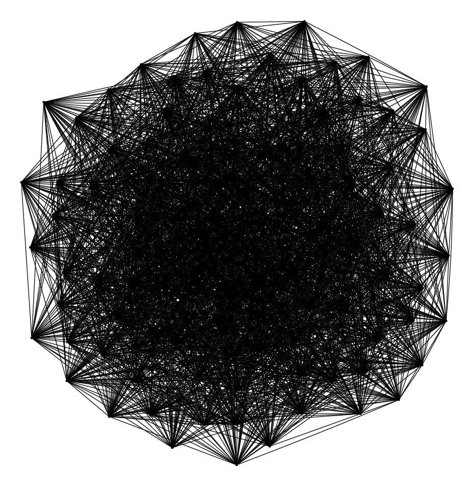

# ggen

## Quickstart

- `brew install uv`
- `brew install graphviz`
- `brew install gnuplot`
- Clone the repo
- `cd` into the top-level repo directory
- `make`
- Check out the Graphviz plots and Gnuplot histograms in the `gallery` subdirectory as well as the CSV files in the `tests` subdirectory

## Background

- [`ggen`](https://github.com/vglazer/USRA/blob/master/subgraph_finding/doc/ggen.md) is part of [a larger suite of programs](https://github.com/vglazer/USRA/tree/master/subgraph_finding) for finding induced subgraphs with a prescribed edge count.
- Among other things, ggen can generate three kinds of random graphs: "exponential" ([Erdős–Rényi](https://en.wikipedia.org/wiki/Erd%C5%91s%E2%80%93R%C3%A9nyi_model)), "power" (scale-free) and "geometric" (in the plane, with no wrap-around).
- It is intended to be used in conjunction with [`sub_search`](https://github.com/vglazer/USRA/blob/master/subgraph_finding/doc/sub_search.md) and is a bit awkward to call directly.
- Moreover, the native graph representation format used by `ggen` and `sub_search` &mdash; effectively the [adjacency lists](https://en.wikipedia.org/wiki/Adjacency_list) corresponding to the upper-triangular portion of the [adjacency matrix](https://en.wikipedia.org/wiki/Adjacency_matrix) &mdash; is non-standard and does not lend itself to visualization or manipulation.
- This standalone repo contains a copy of [`ggen.c`](src/ggen.c) as well as [`ggen.sh`](etc/ggen.sh), a friendlier wrapper for a subset of `ggen`'s functionality. Be sure to `make ggen` before running `ggen.sh`.
- `ggen.sh` outputs graphs in the standard [DOT format](https://graphviz.org/doc/info/lang.html) as well as optionally generating [Graphviz plots](https://graphviz.org/) and [Gnuplot](http://www.gnuplot.info/) histograms. `make create_gallery` will create a bunch of these.
- There are also some additional scripts for producing CSV files suitable for validation, visualization and further processing. `make test` to see them in action.
- The adjacency matrix $A$ of an undirected graph $G = (V, E)$ is the matrix whose ijth entry $a_{ij}$ is $1$ if $\{i, j\} \in E$ and $0$ otherwise. The degree matrix $D$ of $G$ is a matrix whose $i^{th}$ diagonal entry $d_{ii}$ is the degree $deg(v_i)$ of $v_i \in V$, with the off-diagonal entries being $0$. The Laplacian matrix $L$ of $G$, defined as $D - A$, has the following remarkable properties:
  - The smallest eigenvalue $\lambda_0$ is $0$, with eigenvector $\mathbf{1}$. The multiplicity of $\lambda_0$ equals the number of connected components of $G$.
  - Since $\lambda_0$ is $0$, the spectral gap $\lambda_1 - \lambda_0$ is just $\lambda_1$, also known as the Fiedler value. $G$ is connected iff $\lambda_1 > 0$.
  - $\lambda_1$ is inversely proportional to the mixing time of $G$, with the [Cheeger inequality](https://en.wikipedia.org/wiki/Cheeger_constant_(graph_theory)#Cheeger_inequalities) providing a more precise formulation.
  - [matrix2eigs.py](etc/matrix2eigs.py) uses these properties to determine the number of connected components of $G$ and also computes the spectral gap. It also optionally verifies that the off-diagonal entries of $L$ sum to $2 \cdot |E| = \sum\limits_{i}deg(v_i)$ as well as the fact that $tr(L) = \sum\limits_{i}\lambda_i = 2 \cdot |E|$.
  - [Expander graphs](https://en.wikipedia.org/wiki/Expander_graph) have a large spectral gap, so that random walks on them mix rapidly. Check out these [lecture notes](https://www.boazbarak.org/expandercourse/allnotes.pdf) for more info.
